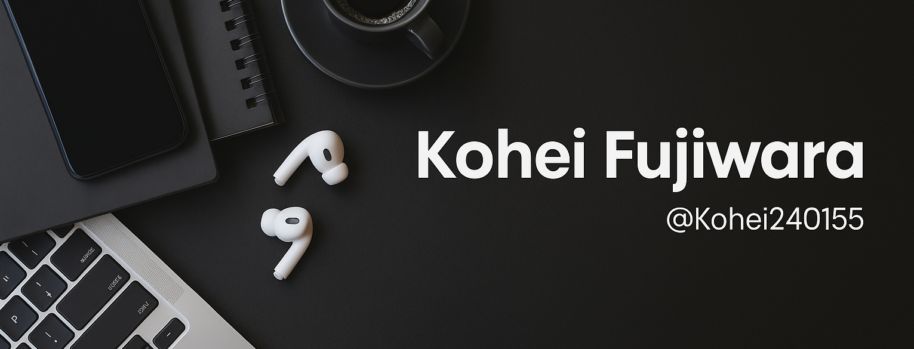

  

 

	
	
	
	

	

## 👨🏻‍💻 **About Me**

<table>
<tr>
<td width="200" align="center">

 <strong>Next.js</strong>
</td>
<td width="400" align="left">

### 👋 **Hi, I'm Kohei Fujiwara!**

🚀 **Full Stack Engineer** with strong focus on **Next.js (TypeScript)**

🌍 **Location:** Japan 🇯🇵 → Vancouver 🇨🇦  
💼 **Focus:** Building scalable web applications with modern stacks  
🎯 **Goal:** Delivering seamless **UI/UX** and robust backend systems  
☕ **Powered by:** Coffee, curiosity, and clean code

</td>
</tr>
</table>

---

## 📊 **GitHub Analytics**

  

  

---

## 🛠️ **Tech Stack**

<table align="center">
<tr>
<td width="50%" align="center" valign="top">

### 🌐 **Frontend**

### ☁️ **Backend**

### 🗄️ **Database**

</td>
<td width="50%" align="center" valign="top">

### ⚡ **DevOps**

### 💻 **Others**

</td>
</tr>
</table>

---

## 🏆 **GitHub Trophies**

  

---

## 📕 **Pinned Repositories**

	

---

## 💭 **Dev Quote**

  

  

